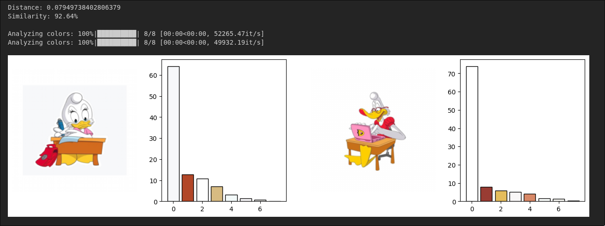
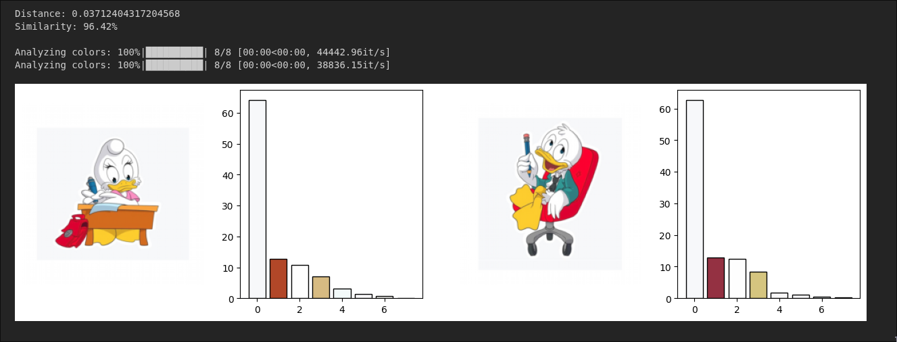

# Image color analysis

The algorithm calculates the 8-color palette of any image including the distribution of colors. The size of the palette is configurable.

To color-analyse a picture:
```sh
python src/colors.py data/logos/1014250.jpg
```

## Examples


# Color similarity ranking

Similarity is determined using [wasserstein distance](https://docs.scipy.org/doc/scipy/reference/generated/scipy.stats.wasserstein_distance_nd.html) based on the color palette distribution generated by the analysis algorithm.

To measure color similarity between two pictures:
```sh
python src/colors.py data/logos/1014250.jpg --compare data/logos/1001179.jpg
```

## Examples



